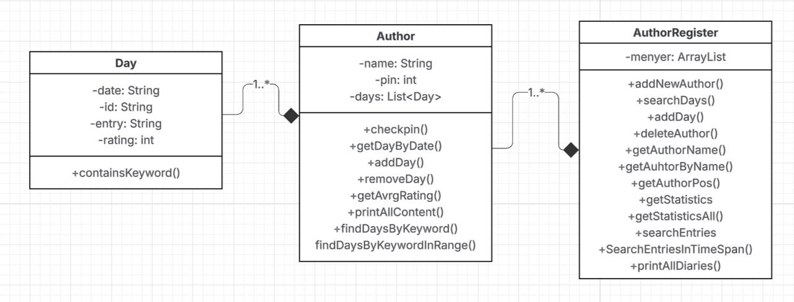
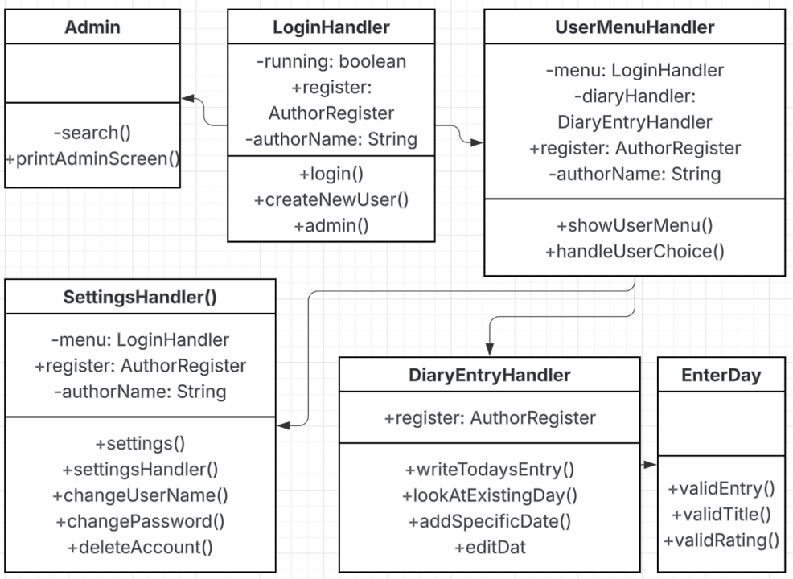

[](https://classroom.github.com/a/INcAwgxk)
# Portfolio project IDATT1003

STUDENT NAME = "Mats Orpia Vestvik"  
STUDENT ID = "587996"

## Project description

[//]: # (TODO: Write a short description of your project/product here.)
This is a complete Diary program with save and security function. The program in this repository is set classup with some showcase users all with the pwd:1234.
To use the program for yourself you can select the option create new account and set a password. After logging in you have the option to write todays entry.
Here you are prompted for a text input and a rating. These are left intentionally ambiguos to allow for a versatile diary program. I allways thougt of the 
value to represent how good my day was.

For more functionality there is also the admin account with the password 1234 for demonstrations sake. Here the admin gains access to all diaries, and can 
view statistics or search entries. The product is designed to be user friendly and fool proof, so the best way to explore the program is to use it.

## Project structure

[//]: # (TODO: Describe the structure of your project here. How have you used packages in your structure. Where are all sourcefiles stored. Where are all JUnit-test classes stored. etc.)
This Java project follows Maven's standard directory structure with a clear package organization based on the reverse domain naming convention. The main source code resides in src/main/java/edu/ntnu/idi/idatt/ and is logically divided into model, service, controller, and util packages, ensuring proper separation of concerns where models handle data entities, services contain business logic, controllers manage application flow, and util packages provide helper functions.

The test code in src/test/java/ mirrors this exact package structure with corresponding *Test.java classes for comprehensive unit testing using JUnit 5 and Mockito. Resource files are organized between src/main/resources/ for application configuration and src/test/resources/ for test-specific data, while quality control is maintained through Maven plugins including Checkstyle for code standards enforcement. This modular architecture supports testability, maintainability, and scalability through clear package boundaries and consistent naming conventions.




## Link to repository

[//]: # (TODO: Include a link to your GitHub repository here.)

[]([https://matsvestvik.github.io/](https://github.com/NTNU-IDI/mappe-2025-MatsVestvik))

## How to run the project

[//]: # (TODO: Describe how to run your project here. What is the main class? What is the main method?
What is the input and output of the program? What is the expected behaviour of the program?)

> [!TIP]
To use this program you must first clone the ropository to a place on yout computer.
You can then create a dektopshortcut that exectutes this command

````markdown
powershell.exe -NoExit -Command "cd 'C:\Users\user\Your\Path\Here' ;java -cp target\classes edu.ntnu.idi.idatt.Main"
````
Remember to replace "C:\Users\user\Your\Path\Here" with your path.
And thats it. Now You have a desktop shortcut that starts the program.

With the program you can create a new account with an accosiated pin adn explore the program.
The program features save and load features so your entries will eb saved between sessions.

## How to run the tests

[//]: # (TODO: Describe how to run the tests here.)

The project's test suite can be executed using Maven commands, primarily through mvn test which runs all unit tests located in the parallel test directory structure under src/test/java/. Developers can run specific test classes with mvn test -Dtest=ClassName or individual methods using mvn test -Dtest=ClassName#methodName, while the Maven Surefire plugin automatically generates detailed reports in both console output and HTML format at target/site/surefire-report.html. The tests are integrated into the build lifecycle and also run during mvn verify or mvn package commands, ensuring code quality is maintained through continuous validation using JUnit 5 and Mockito frameworks.

## References

[//]: # (TODO: Include references here, if any. For example, if you have used code from the course book, include a reference to the chapter.
Or if you have used code from a website or other source, include a link to the source.)

